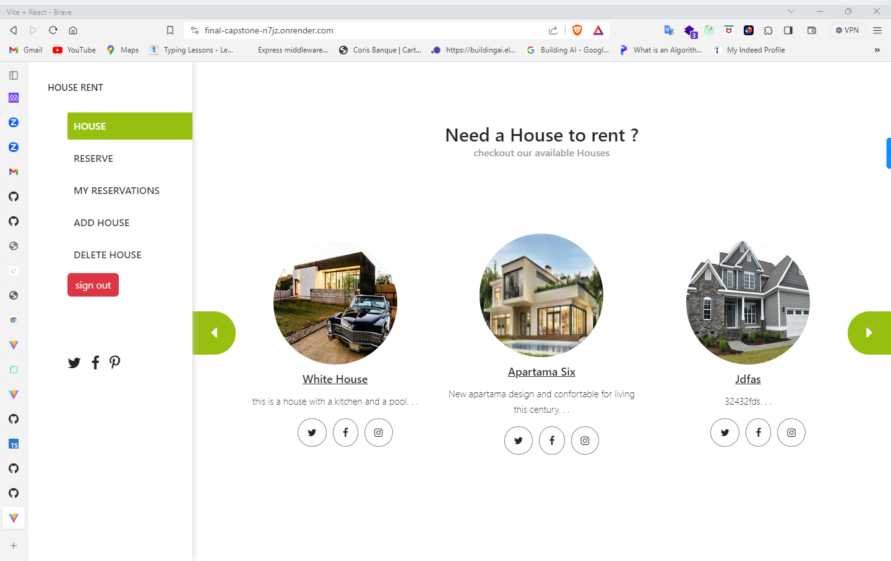
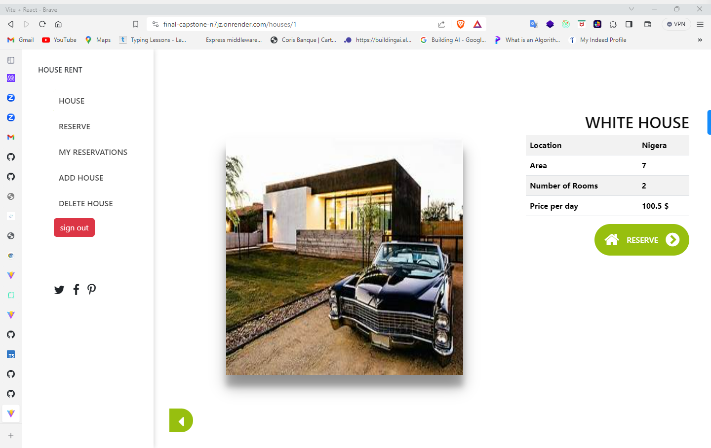
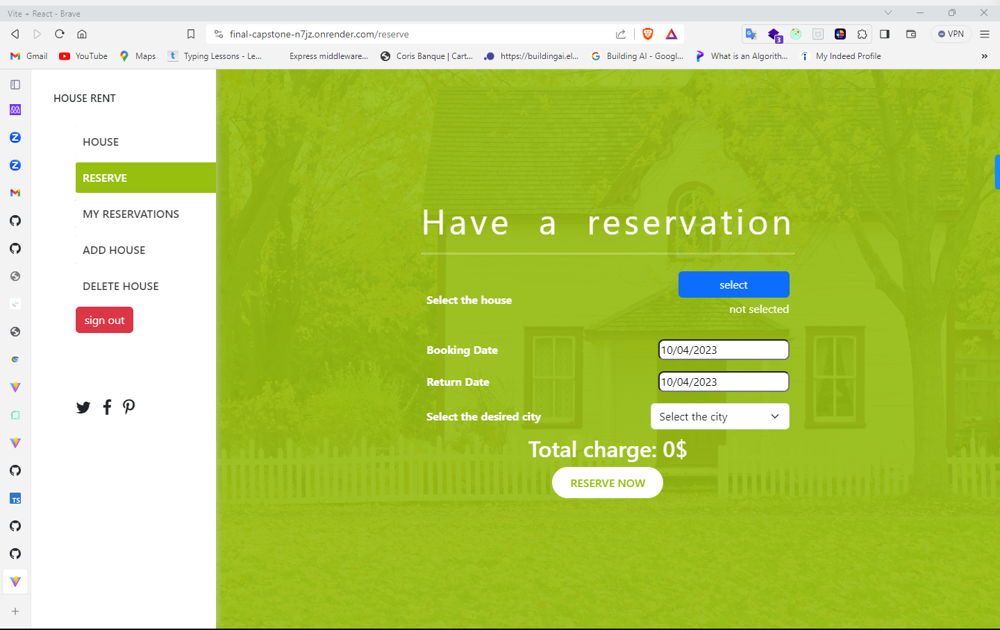

<a name="readme-top"></a>

<div align="center">
  <h1>RentHub</h1>
  <h2>📖 Final Capstone front end App</h2>
</div>


<!-- TABLE OF CONTENTS -->

# 📗 Table of Contents

- [📖 About the Project](#about-project)

  - [🛠 Built With](#built-with)
    - [Key Features](#key-features)
  <!-- - [🚀 Live Demo](#live-demo) -->
- [💻 Getting Started](#getting-started)
  - [Prerequisites](#prerequisites)
  - [Setup](#setup)
- [👥 Authors](#authors)
- [🔭 Future Features](#future-features)
- [🤝 Contributing](#contributing)
- [⭐️ Show your support](#support)
- [🙏 Acknowledgements](#acknowledgements)
- [:question: FAQ](#faq)
- [📝 License](#license)

<!-- PROJECT DESCRIPTION -->

# 📖 RentHub <a name="about-project"></a>

> This is a react app which will serve as the front end app for our RentHub back end app.This app can use to reserve houses and view houses.Also a user can add his own house and rent.

## [Link to the Site](https://final-capstone-n7jz.onrender.com)

## [Link to the back-end repo](https://github.com/yashodhicy/Final-capstone-back-end)

## Kanban board initial state


## [Link to the kanbarn board](https://github.com/users/yashodhicy/projects/6)




<br>
<br>

# Demo Account

```json
email: testuser@email.com
password: p@ssw@rd
```

## The learning objective of this project are

- Create react front end app
- Connect react front end app to rails back end
- Use API end point to get data
- Fetch data from the API

## Built With

- React
- Redux

<!-- Features -->

### Key Features <a name="key-features"></a>

- **Reserve Houses**
- **Rent Houses**
- **Delete and Add houses**

## Getting Started

To get a local copy up and running follow these simple example steps.

### Prerequisites

- [React](https://reactjs.org/tutorial/tutorial.html#prerequisites)

### Setup

- ```git clone https://github.com/yashodhicy/Final-capstone-front-end.git```

- ```cd Final-capstone-front-end```

### Running The App Locally

- Install `npm install`
- Run `npm run dev`

## Authors

👤 : **Yashodhi Chathurangi**

- GitHub: [@githubhandle](https://github.com/yashodhicy)
- Twitter: [@twitterhandle](https://twitter.com/Yashichathucy)
- LinkedIn: [LinkedIn](https://www.linkedin.com/in/yashodhichathurangi/)


👤 **Mahamadou Nouridine**

- GitHub: [mahamadou-nouridine](https://github.com/mahamadou-nouridine)
- Linkedin: [mahamadou-nouridine](https://www.linkedin.com/in/mahamadou-nouridine)
- Twitter: [Nouridine_Dino](https://twitter.com/Nouridine_Dino)

👤 **Brhanu Hailu**

- GitHub: [@brhanuhailu](https://github.com/brhanuhailu)
- Twitter: [@tigraycountry](https://twitter.com/TigrayCountry)
- LinkedIn: [LinkedIn](https://www.linkedin.com/in/brhanu-hailu-85578a246/)

## 🤝 Contributing

Contributions, issues, and feature requests are welcome!

Feel free to check the [issues page](https://github.com/yashodhicy/Final-capstone-front-end/issues).

## Show your support

Give a ⭐️ if you like this project!

## Acknowledgments

- Hats off to [Murat Korkmaz](https://www.behance.net/muratk) for designing the awesome template that was used. ✨
- Microverse for giving us this chance
- The amazing code reviewers for making us improve every day 👍
